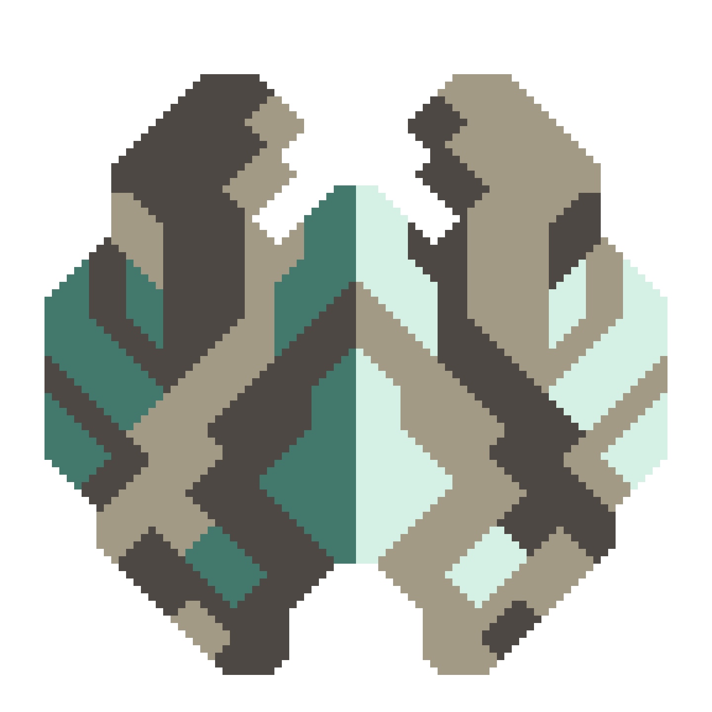

# Farborne Industries

## Re:Updates are back on the menu 
Welcome to Farborne Industries! Explore Erbius, a terrestrial planet covered predominantly in water, and Deimo, Erbius's moon, which is covered in lakes of Ethane

All sectors (except for Embark and Trench) will be completely remade from scratch relatively soon

### Attributions
Special thanks to all of the following:

♡  Annie, for supporting me and bringing joy to my life

☆  Endofreeze, for your immense help with the project, including brainstorming and sprites

☆  CasualWhale, for playtesting and feedback

☆  Sh1penfire, for creating the best sector in the mod: Trench, and for the 'planetarium' script

✧  Nullevoy, for helping sprite the Withdraw turret

✧  Abreaker, for helping with the Dread team glyph script

✧  2017Knight2017, for Strontium and Edison concepts

✧ Slotterleet, for creating the Example Planet JSON mod

✧  Anuke, for creating Mindustry

✧  Special thanks to the Mindustry Discord and everyone else who helped me create my first public game mod

#### Consider joining my [Telegram channel](https://t.me/farborne) 
